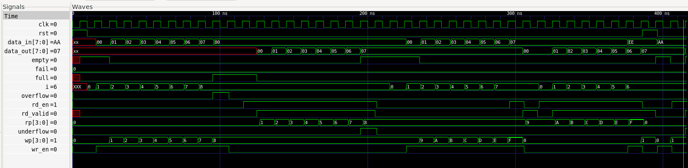
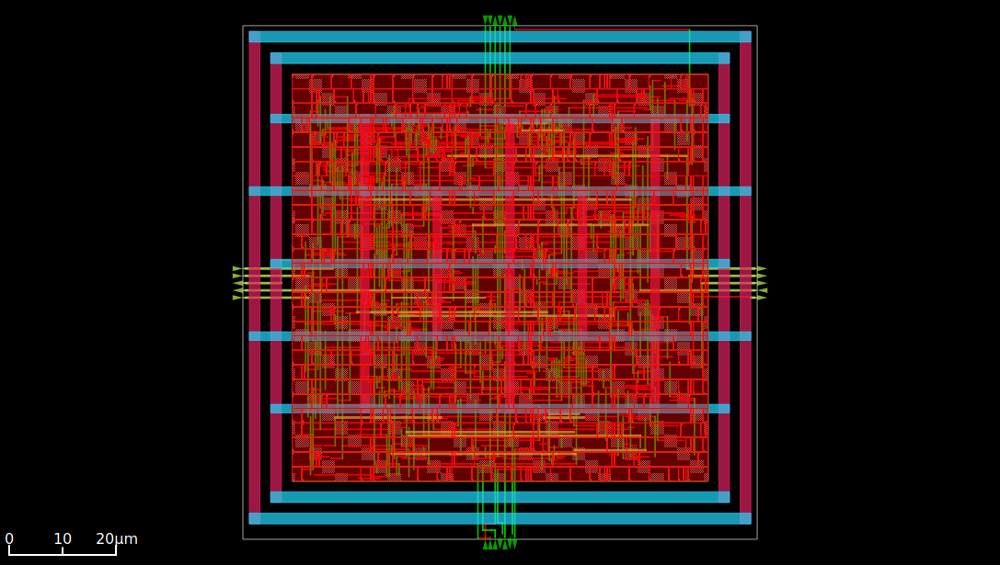
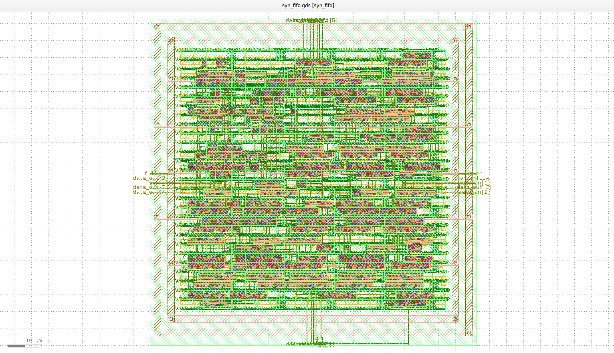

# Synchronous FIFO — RTL to GDSII

An 8-word × 8-bit synchronous FIFO, taken end-to-end through the open-source
RTL-to-GDSII flow: RTL design → self-checking verification → synthesis →
static timing analysis → floorplanning → power delivery → placement → clock
tree synthesis → routing → parasitic extraction → GDSII → foundry-grade DRC
→ LVS, on the SkyWater 130nm open PDK (`sky130_fd_sc_hd`).

---

## Contents

- [Design overview](#design-overview)
- [Toolchain](#toolchain)
- [Repository layout](#repository-layout)
- [1. RTL design](#1-rtl-design)
- [2. Functional verification](#2-functional-verification)
- [3. Synthesis](#3-synthesis)
- [4. Static timing analysis](#4-static-timing-analysis)
- [5. Physical implementation](#5-physical-implementation)
- [6. GDSII, DRC, and LVS](#6-gdsii-drc-and-lvs)
- [Final results summary](#final-results-summary)
- [Known limitations / future work](#known-limitations--future-work)
- [How to reproduce](#how-to-reproduce)

---

## Design overview

| Parameter | Value |
|---|---|
| Depth | 8 words |
| Data width | 8 bits |
| Reset | Synchronous, active-high |
| Full/empty detection | MSB-extended (N+1 bit) pointer comparison |

**Ports:**

| Signal | Dir | Width | Purpose |
|---|---|---|---|
| `clk`, `rst` | in | 1 | Clock, synchronous reset |
| `wr_en`, `rd_en` | in | 1 | Write / read enable |
| `data_in` | in | 8 | Write data |
| `data_out` | out | 8 | Read data (registered, holds last value while empty) |
| `full`, `empty` | out | 1 | Status flags |
| `overflow`, `underflow` | out | 1 | Pulses on an illegal write/read attempt |

`almost_full` was deliberately deferred — the design only implements it via
a documented, un-verified pointer-subtraction formula and is noted as a
future extension rather than shipped half-tested.

---

## Toolchain

| Stage | Tool | PDK data used |
|---|---|---|
| Simulation | Icarus Verilog + GTKWave | — |
| Code coverage | Covered | — |
| Synthesis | Yosys | `sky130_fd_sc_hd__tt_025C_1v80.lib` |
| Static timing | OpenSTA | same liberty, `nom` tech LEF |
| Floorplan / place / CTS / route | OpenROAD | tech + cell LEF, extraction rules |
| GDSII streamout | Magic | `sky130A.tech`, PDK's pre-built cell GDS |
| DRC | KLayout | `sky130A.lydrc` (BEOL macro) |
| LVS | netgen | `sky130A_setup.tcl` |

All corner selection is consistent throughout: **`tt` (typical) liberty ↔
`nom` (nominal) tech LEF/tech file**, matching the standard convention that
typical device corners pair with nominal interconnect parasitics.

---

## Repository Structure

```text
.
├── Images/                          # Screenshots of design flow and results
│   ├── final_gdsii_layout.png       # Final ASIC layout in KLayout
│   ├── final_post_route_view.png    # Routed design after detailed routing
│   ├── floorplan_powerplan.png      # Floorplan with PDN
│   └── simulation_waveform.png      # RTL simulation results
│
├── Physical_design/                 # OpenROAD physical design flow
│   ├── design_flow.tcl              # Complete automated implementation flow
│   ├── detailed_route.def           # Final routed DEF
│   └── syn_fifo_netlist_postroute.v # Post-route gate-level netlist
│
├── Physical_verification/           # GDS generation and physical verification
│   ├── gds_out.tcl                  # GDSII generation script
│   ├── lvs_extract.tcl              # LVS extraction script
│   ├── syn_fifo.gds                 # Final GDSII layout
│   ├── sky130_drc.txt               # DRC report
│   ├── syn_fifo_lvs.json            # LVS results (JSON)
│   └── syn_fifo_lvs.report          # LVS report
│
├── RTL/                             # RTL design and functional verification
│   ├── syn_fifo.v                   # FIFO RTL
│   ├── syn_fifo_tb.v                # Testbench
│   └── coverage_report.txt          # Simulation coverage report
│
├── STA/                             # Static Timing Analysis
│   ├── sta.tcl                      # STA script
│   └── syn_fifo.sdc                 # Timing constraints
│
├── Synthesis_yosys/                 # RTL synthesis using Yosys
│   ├── synthesis.ys                 # Yosys synthesis script
│   ├── syn_fifo_netlist.v           # Generic synthesized netlist
│   └── syn_fifo_netlist_sky130.v    # Sky130 mapped netlist
│
├── .gitignore                       # Git ignore rules
├── LICENSE                          # MIT License
└── README.md                        # Project documentation
```

Each `.tcl` file is commented with the reasoning behind every non-obvious
flag choice, plus a `FINDINGS` block with the actual numbers that run
produced.


---

## 1. RTL Design

The core design decision worth understanding: **full/empty detection uses
pointers one bit wider than strictly needed for addressing.** For a
depth-8 FIFO, addressing needs 3 bits, but the pointers are 4 bits. The
extra MSB acts as a "lap counter" — it flips every time the pointer wraps
around the buffer — which resolves the classic ambiguity where
`wr_ptr == rd_ptr` alone can't distinguish *empty* from *full*.

```verilog
assign full  = (rd_ptr[MSB] ^ wr_ptr[MSB]) & (wr_ptr[MSB-1:0] == rd_ptr[MSB-1:0]);
assign empty = (wr_ptr == rd_ptr);
```

`empty` is just full pointer equality (both address *and* lap match).
`full` is address match with laps *differing* — the write pointer has
lapped the read pointer exactly once. Pointer increments are gated
(`rd_ptr + (rd_en & ~empty)`) so an illegal read/write never advances a
pointer or corrupts memory, and `overflow`/`underflow` are asserted exactly
when a write/read is attempted against a full/empty buffer.

The read/write memory block is **not** reset — only the pointers are.
This was a deliberate decision, verified (not assumed) by simulation: since
FIFO state is entirely defined by pointer relationships, stale memory
contents after reset are simply unreachable until legitimately overwritten,
and `data_out` correctly holds its last value while `empty=1` signals it
shouldn't be trusted yet.

---

## 2. Functional Verification

The testbench is self-checking (an independent `expected[]` reference array,
not just waveform inspection) and covers:

- Fill to full, blocked 9th write, `overflow` pulse
- Drain to empty, blocked read, `underflow` pulse
- **A second pointer wraparound lap** (refill after drain) — the MSB-trick's
  correctness on the *second* lap, not just the first, is where subtle bugs
  tend to hide
- Simultaneous read+write at the **near-full** boundary (`full` must not
  falsely assert)
- Simultaneous read+write at the **near-empty** boundary (`empty` must not
  falsely assert)
- Reset asserted **mid-operation**, not just at time zero
- Post-reset write/read sanity

## RTL Simulation



*Functional simulation of the synchronous FIFO verifying correct write, read, full, empty, overflow, and underflow operations.*

### Two real bugs found — in the testbench, not the design

**Bug 1 — a stimulus race silently corrupted a real memory write.**
The original test wrote 8 values then immediately reused `data_in` to set
up a 9th (blocked) write, with no intervening clock edge to let the last
real write actually be captured. `data_in` was overwritten *before* the
edge that was supposed to capture it, so `mem[7]` ended up holding the
sentinel value instead of the real data — and the checker, which derives
its "expected" array from the same live signals, silently mirrored the
same corruption instead of catching it. `failed cases: 0` was reported
while the design's memory was genuinely wrong. Found by an explicit
external check (`$display dut.mem[7]`) independent of the checker's own
logic — the fix was an extra `@(posedge clk); #1;` before touching
`data_in` again.

**Bug 2 — the checker sampled a control signal after it had already changed.**
The scoreboard captured `rd_en`/`underflow` *after* a `#2` settling delay
(needed to let the DUT's registered `data_out` update), but stimulus could
change `rd_en` for the *next* edge within that same 2ns window — causing the
checker to test the wrong edge's validity. Fixed by capturing
`rd_valid = rd_en & ~underflow` immediately at the clock edge, before the
delay, decoupling "when is it safe to read `data_out`" from "was this edge's
read actually legal."

Both fixes were verified by **deliberately re-injecting the original bug**
(removing the `~full` gate on the memory write) and confirming the fixed
testbench caught it precisely — correct location, correct expected/actual
values — rather than trusting a passing run at face value.

### Code coverage

Measured with [Covered](https://github.com/chiphackers/covered) against the
final testbench's simulation VCD:

```bash
covered score -t syn_fifo -i syn_fifo_tb.dut -v syn_fifo.v -vcd dump.vcd -o syn_fifo.cdd
covered report -d v syn_fifo.cdd
```

| Metric | Result |
|---|---|
| Line coverage | 15/15 — **100%** |
| Toggle coverage | 0→1: 29/32 (91%), 1→0: 24/32 (75%) |
| Combinational logic coverage | 52/53 — **98%** |
| FSM coverage | 0/0 (not applicable — see below) |

**Interpreting the gaps honestly, not just quoting the numbers:**

- **Toggle coverage** is below 100% specifically on `data_in`/`data_out` —
  expected, since the testbench drives small, sequential, directed values
  (`0, 1, 2, ...`) rather than the full 256-value range of an 8-bit bus.
  Every *control* signal (pointers, flags) toggles fully; only the *data*
  bus doesn't exercise every bit pattern. This is a legitimate coverage
  gap, not a bug — closing it would mean adding randomized data values to
  the write sequence, which the functional corner-case testing didn't
  need.
- **Combinational logic coverage** misses one branch on line 47
  (`data_out <= mem[rd_ptr[...]]`) — one of the two possible outcomes of
  an internal expression inside that statement was never exercised by the
  specific corner-case sequence used. Worth tracing exactly which value
  combination is missing before assuming it's benign.
- **FSM coverage shows 0/0 (trivially 100%)** because this design has no
  explicit state machine — control is done entirely through pointer
  arithmetic and combinational flag logic, not a `case`-based state
  register, so there's no FSM for the tool to measure.

---

## 3. Synthesis

```
Total area:        ~3051.68 µm²   (~47.7 µm²/bit of storage)
Flip-flops:         80 total
  8  × sky130_fd_sc_hd__dfxtp_1   (plain, no reset pin)
  72 × sky130_fd_sc_hd__edfxtp_1  (enable, no reset pin)
Latches:             0
```

The 8/72 flip-flop split is not incidental — it directly reflects the
RTL's structure: the pointer `always` block has an `if(rst)` branch (→
plain flops), the memory/`data_out` block doesn't (→ enable flops with no
reset input at all). Confirmed by cross-referencing synthesis output
against the RTL's own coding style — a concrete example of coding style
directly determining synthesized hardware.

---

## 4. Static Timing Analysis

Performed twice: **pre-route** (estimated wire delay) and **post-route**
(real extracted parasitics from the actual routed geometry, via
`fifo.spef`) — the second is the trustworthy, sign-off number.

| Metric | Pre-route | Post-route (final) |
|---|---|---|
| Worst setup slack (I/O-bound) | 5.84 ns MET | 5.69 ns MET |
| Worst setup slack (reg2reg) | 7.48 ns MET | 6.22 ns MET |
| Worst hold slack | 0.54 ns MET | 0.58 ns MET |
| Est. max frequency (I/O-bound) | ~240 MHz | ~232 MHz |

The reg2reg path is consistently *more* comfortable than the I/O-bound
path at every stage — meaning the FIFO's own internal logic has never been
the real bottleneck; the assumed 2ns I/O timing budget is. This is a
distinction worth being able to explain, not just a number to quote.

Setup and hold were checked separately and explicitly at every stage
(including after clock tree synthesis, where a *new* class of risk —
clock skew — becomes possible for the first time) rather than assuming a
clean setup check implies a clean hold check.

---

## 5. Physical Implementation

**Floorplan:** 50% target utilization (51.5% effective, after grid
snapping), square core, `unithd` site. I/O pins placed on met2/met3.

**Power delivery:** ring + straps on met4/met5, tied to a `CORE` voltage
domain. Standard-cell rows connect via met1↔met4 vias.

**Placement:** global placement (wirelength-driven; no evidence this small,
high-margin design needed timing-driven placement) followed by legalization
(100% diamond-move success, +19% HPWL cost — normal for legalization, not a
sign of a struggling placement).

**Clock tree synthesis:** 9 buffers, 2-level tree, near-zero setup skew.

### The major investigation: `DRT-0073` — "No access point" during routing

After CTS, detailed routing consistently failed on a specific, *repeatable*
set of CTS-inserted cells — never the original logic cells. The root cause
was found by systematic elimination, not guesswork:

1. Changed CTS buffer size (`clkbuf_4` → `clkbuf_8`) — **identical failure
   set**, ruling out buffer sizing.
2. Enabled CTS's `-obstruction_aware` flag — **no change**, ruling out an
   unrecognized physical obstruction.
3. Tightened sink-clustering topology — **no change**, ruling out tree
   shape.
4. Compared cell **orientation** between a failing and a passing instance
   via direct ODB queries — **identical**, ruling out orientation.
5. Compared physical **coordinates** — both comfortably interior, ruling
   out edge/boundary proximity.
6. **GUI visual inspection** at the failing coordinate showed the cell's
   pin shape not aligned with the routing track grid.

The actual cause: **CTS inserts brand-new physical cells (buffers + dummy
loads) using its own topology math, and nothing in the flow ever
re-legalizes them onto the site grid.** Detailed placement had only ever
run once, *before* CTS existed. Adding a second `detailed_placement` pass
after CTS (`cts_legalized.tcl`) resolved the issue completely — confirmed
by detailed routing subsequently completing with **0 violations** and
**0 unmapped pin accesses**.

**Routing result:** 0 DRC violations, ~6128 µm total wire length, 452
filler cells placed to close remaining row gaps. Antenna check: passed.

## Post-Route Layout



*Final routed implementation of the Sky130 synchronous FIFO demonstrating successful placement, Clock Tree Synthesis (CTS), and detailed routing.*

### Stage-by-stage numbers

The numbers below are pulled from `design_flow.tcl`'s inline `FINDINGS`
comments — that file is the authoritative source (each number sits next
to the exact command/flags that produced it, with the full reasoning);
this table exists just for at-a-glance scanning, not as a duplicate
narrative.

| Stage | Key figures |
|---|---|
| Floorplan | Core 5920.7 µm², utilization 51.5% (target 50%), 24 I/O pins, 75 tap cells |
| Power planning | 4 global connection rules, ring fits with 9µm core margin |
| Global placement | HPWL ≈ 3382.7 µm, overflow 0.099 |
| Detailed placement | 100% diamond-move success, HPWL → 4033.8 µm (+19%) |
| CTS | 9 buffers, 7 dummy loads, 2 tree levels, setup skew 0.00 ns |
| Post-CTS legalization | 0.3 µm avg. displacement, 0% HPWL delta |
| Global routing | No congestion warnings |
| Detailed routing | 0 violations, 452 fillers, ~6128 µm total wire length |

---

### Power

`report_power`, using the real post-route extracted parasitics:

| Group | Internal | Switching | Leakage | Total | % |
|---|---|---|---|---|---|
| Sequential | 377 µW | 5.10 µW | 0.72 nW | 382 µW | **69.9%** |
| Combinational | 13.6 µW | 8.09 µW | 0.21 nW | 21.7 µW | 4.0% |
| Clock | 75.3 µW | 67.8 µW | 0.07 nW | 143 µW | 26.2% |
| **Total** | 466 µW | 81.0 µW | 1.0 nW | **547 µW** | 100% |

- **Sequential dominates (70%)** — expected: 80 flip-flops toggle their
  clock input every single cycle *regardless of whether the FIFO is
  actually being written to or read from*. This is structural, not
  data-dependent, power — it wouldn't drop even if `wr_en`/`rd_en` were
  held low indefinitely.
- **Clock network is the second-largest consumer (26%)** — consistent
  with a 9-buffer tree driving 80 sinks; toggling that tree is inherent
  overhead of clocking any synchronous design, separate from the logic
  it drives.
- **Combinational logic is small (4%)** — matches the design's shallow
  logic depth (STA showed max 4–5 gates on the longest reg2reg path).
- **Leakage is negligible (0.0%)** — expected for a small design at this
  node with no explicit low-power techniques applied; not a meaningful
  contributor to total power here.
- **Internal power (85%) far exceeds switching power (15%)** — again
  consistent with a flip-flop-dominated design, where most power goes
  into charging/discharging each flop's internal nodes on every clock
  edge, not into driving external net capacitance.

**Caveat, stated honestly rather than left implicit:** this was computed
under OpenROAD's default vectorless activity assumptions — no real
switching-activity file (VCD/SAIF from the testbench) was loaded via
`read_power_activities` before running `report_power`. It's a legitimate
structural estimate, not a workload-derived measurement tied to this
FIFO's actual simulated traffic patterns. Re-running with real activity
annotated would give a more precise number and is a reasonable next step.

---

## 6. GDSII, DRC, and LVS

## Layout



*Placed and routed FIFO, SkyWater 130nm, 96.125 × 96.125 µm die.*

**GDSII streamout (Magic):** required loading the PDK's pre-built cell GDS
*before* reading the DEF — LEF alone only contains abstract cell outlines,
never real polygon geometry, and Magic correctly refuses to stream abstract
views to GDS.

**DRC (KLayout, `sky130A.lydrc`, BEOL check):** **all rules green, 0
violations.**

**LVS (netgen):** mixed, honestly reported rather than hidden.
- **Device count matches exactly: 167 = 167.**
- **Every real signal net compared matched exactly** — same fanout, same
  connections, wherever a direct comparison was possible (control logic,
  pointers, memory array, data path, clock distribution).
- **Does not pass cleanly overall**, due to a `VPWR`/`VPB` (and
  `VGND`/`VNB`) net-segmentation mismatch: Magic's polygon-based extractor
  reports the power rail and the substrate/well body-tie as separate net
  fragments in places, while the intended design (and the Verilog netlist)
  treats them as one merged net. This is a **documented, known class of
  limitation in open-source sky130 body-tie extraction** — confirmed
  against a real community case study describing the identical symptom —
  not a functional defect in this design. Every genuine fix found during
  the investigation (missing power connections on CTS-inserted cells, tap
  cell body-tie connections, explicit power/ground netlist inclusion) was
  applied and kept, because each one corrected a real gap in the physical
  database, independent of LVS. What remains unresolved is a substrate
  extraction/reporting limitation, not a corrected-away symptom.

**Honest bottom line:** functional correctness is fully verified at every
level from RTL simulation through post-route signal-level LVS. Full
foundry-grade power-network sign-off would need deeper physical
verification of tap-strap continuity before this design could be called
genuinely tapeout-ready.

---

## Final Results Summary

| Metric | Result |
|---|---|
| Functional verification | All corner cases pass, self-checking, bug-injection proven |
| Synthesized area | ~3051.7 µm² |
| Flip-flops | 80 (0 latches) |
| Post-route worst setup slack | 5.69 ns @ 10ns clock (MET) |
| Post-route worst hold slack | 0.58 ns (MET) |
| Est. max frequency | ~232 MHz (I/O-bound assumption) |
| Total power (report_power, real parasitics, default activity) | 547 µW (70% sequential, 26% clock, 4% combinational) |
| Routing violations | 0 |
| Antenna violations | 0 |
| DRC violations | 0 |
| LVS | Device-level and signal-level match; power-net segmentation open finding (documented) |

---

## Known Limitations / Future Work

- `almost_full` is unimplemented (deferred, documented in RTL comments)
- LVS power-network segmentation not fully resolved (see above)
- No IR-drop / power-grid analysis performed (needs real pad/bump
  locations to be meaningful — not applicable to a standalone block)
- `repair_design` (slew/cap/fanout DRC-style checks) and `repair_antennas`
  from the reference OpenROAD flow were not run as separate explicit steps
  — worth adding for a production-grade flow
- Full foundry sign-off (multi-corner STA across `ff`/`ss`, not just `tt`)
  not performed
- Power estimate uses default vectorless switching activity, not real
  testbench-derived activity (`read_power_activities` not run)

## How to Reproduce

```bash
# Simulation (RTL/)
iverilog -o fifo_sim syn_fifo.v syn_fifo_tb.v && vvp fifo_sim

# Code coverage (RTL/)
covered score -t syn_fifo -i syn_fifo_tb.dut -v syn_fifo.v -vcd dump.vcd -o syn_fifo.cdd
covered report -d v syn_fifo.cdd

# Synthesis (Synthesis_yosys/)
yosys -s synthesis.ys

# Pre-route STA (STA/)
sta sta.tcl

# Physical implementation (Physical_design/) -- runs floorplan through
# routing + extraction in one script
openroad design_flow.tcl

# Post-route sign-off STA, fresh session with real SPEF (Physical_design/)
sta sta_final.tcl

# GDSII + LVS extraction (Physical_verification/)
magic -dnull -noconsole -T <path-to-sky130A.tech> gds_out.tcl
# (in the same Magic session) source lvs_extract.tcl

# DRC (Physical_verification/)
klayout -b -r <path-to-run_drc_beol.lydrc> syn_fifo.gds

# LVS (Physical_verification/)
netgen -batch lvs "syn_fifo.spice syn_fifo" \
  "../Physical_design/syn_fifo_netlist_postroute.v syn_fifo" \
  <path-to-sky130A_setup.tcl> syn_fifo_lvs.report -json
```

All PDK file paths are placeholders — substitute your local
`sky130A` PDK installation paths throughout.
